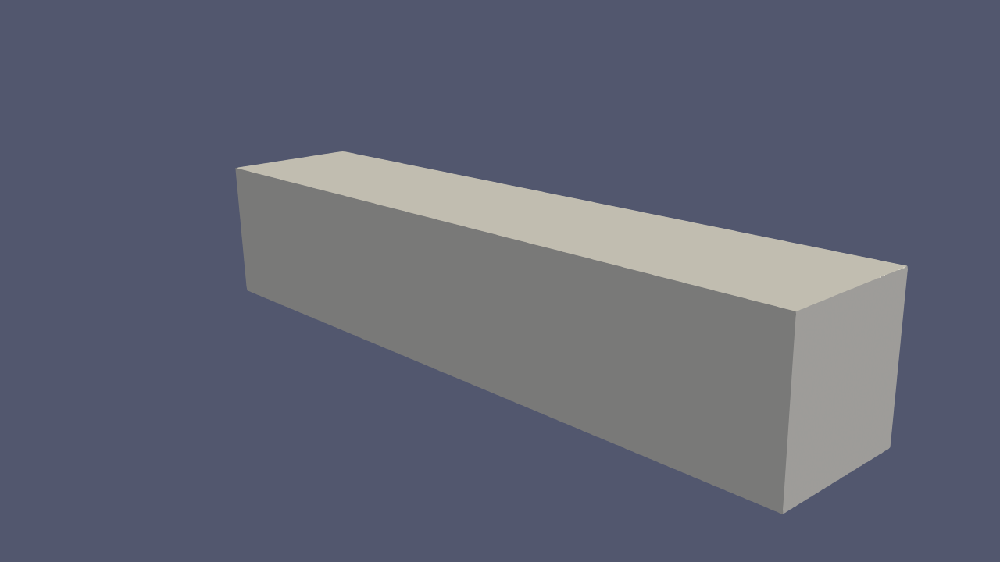
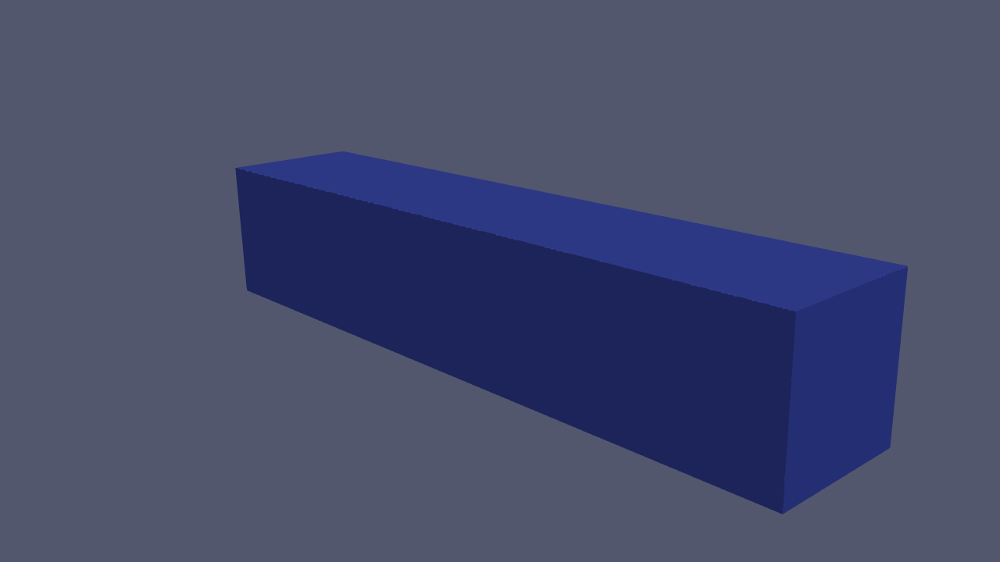

# Nonlinear compression of perforated materials (DOLFINx)

Nonlinear, quasi-static compression of:
- a **2D perforated material** with **square stacking of holes**, and
- a **3D perforated beam** (holes cut out of the bulk).

Example 3D geometry and deformation are shown in `geometry.gif` and `deformation.gif`.

## Contents
- **2D/3D mesh generation** with **Gmsh**
- **Newton–Raphson** solver (`solver.py`) implemented in **DOLFINx**
- **Eigenvalue / instability analysis** using **SLEPc**

## Preview

